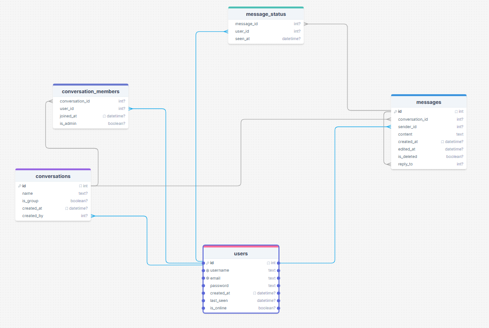

# Koroba-Chat 

Une application de messagerie temps réel construite avec Node.js et React.

## Stack technique

### Backend (JavaScript)
| Librairie | Rôle |
|---|---|
| **express** | Serveur et gestion des routes GET/POST |
| **sqlite3** | Base de données |
| **jsonwebtoken** | Création et vérification des tokens JWT |
| **bcryptjs** | Hash des mots de passe |
| **cors** | Communication entre frontend et backend |

### Frontend (JavaScript)
| Librairie | Rôle |
|---|---|
| **react** | Composants UI réutilisables |
| **react-dom** | Affichage React dans le navigateur |
| **vite** | Serveur de développement |

## Installation

### Backend
```bash
cd backend
npm install
node server.js
```

### Frontend
```bash
cd frontend
npm install
npm run dev
```

## Structure du projet

```
Koroba-Chat/
├── backend/
│   ├── server.js
│   ├── database.js
│   ├── models/
│   ├── routes/
│   └── auth/
└── frontend/
    ├── public/
    └── src/
        ├── App.jsx
        ├── components/
        └── api/
```
## Structure db


